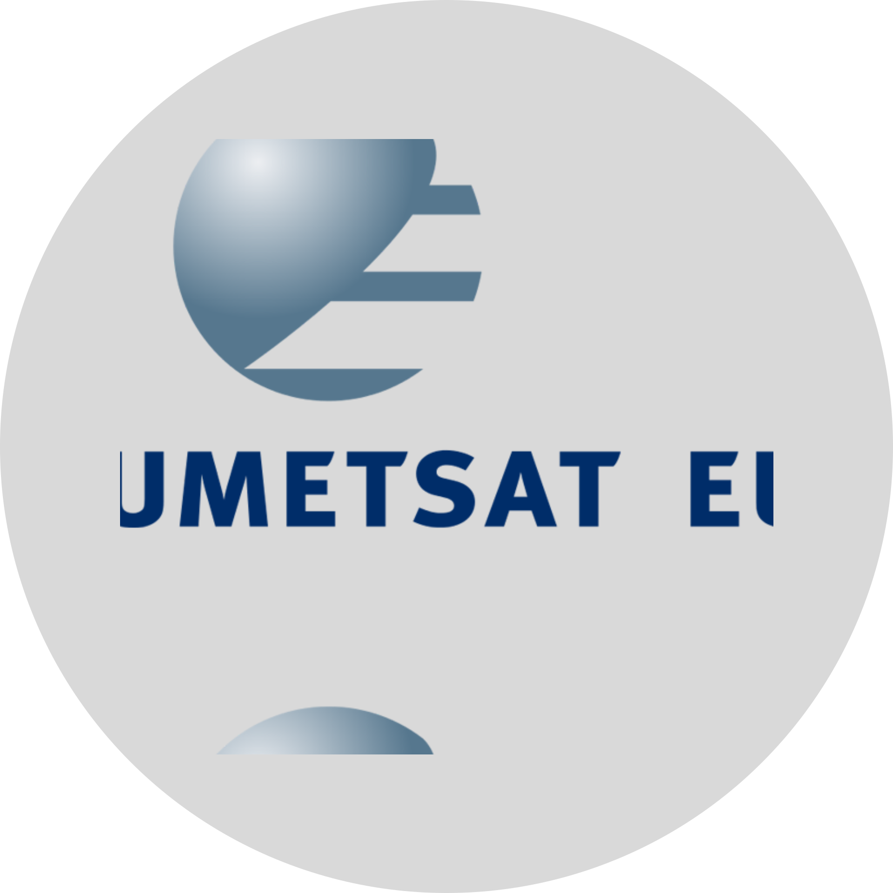
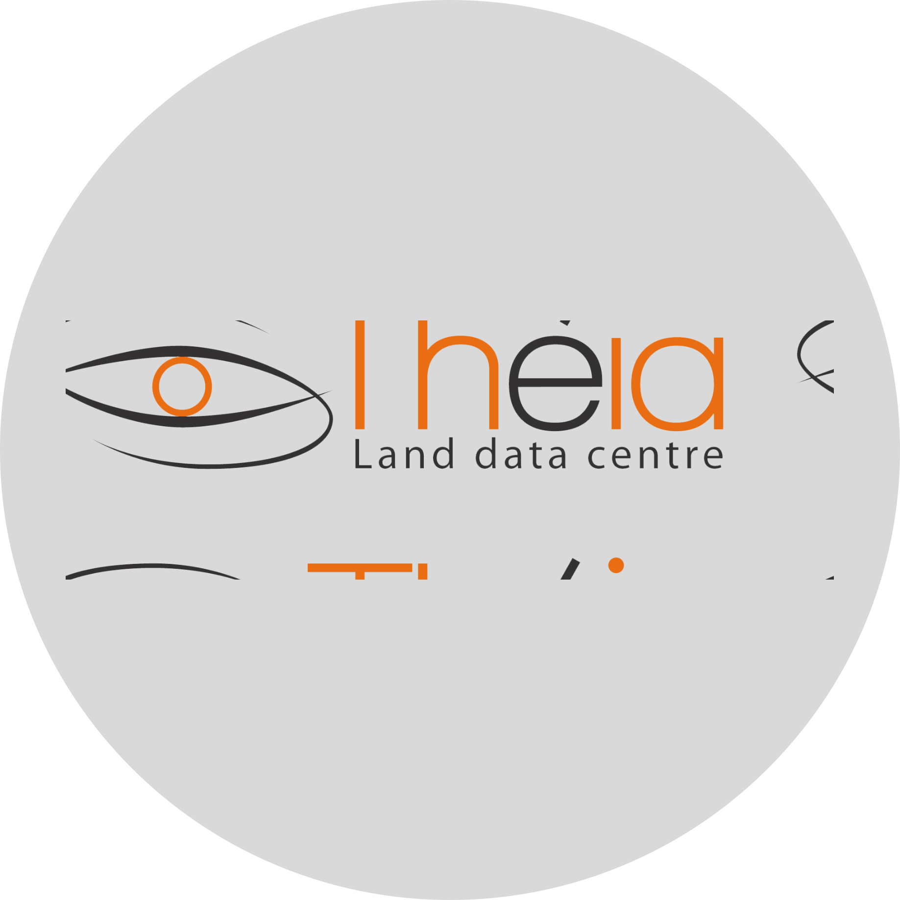

<!-- PROJECT LOGO -->
<br />
<picture>
<source media="(prefers-color-scheme: dark)" srcset="img/SAND_dark_theme.svg" width="300">
<source media="(prefers-color-scheme: light)" srcset="img/SAND_light_theme.svg" width="300">

</picture>

# Satellite Acquisition Normative Downloader

[**Quickstart**](#get-started)
| [**Install guide**](#installation)

<!-- ABOUT THE PROJECT -->
## What is SAND ?

**SAND** is a python module that simplifies the downloading of satellite data supplied by various providers. 
It also acts as a proxy for executing the API requests and is designed to use a minimum of dependency to facilitate its incorporation into production lines. 

## Registration to providers

Depending on the provider or resource you want to download, you will need to add your credentials in the *.netrc* file in the home folder. To help you create your different accounts, please find below a table summarising the different registration links.


| Provider | Registration | TOTP | 
| --- | --- | --- | 
| CDS | [dataspace.copernicus.eu](https://dataspace.copernicus.eu/) |  | 
| CNES | [theia.cnes.fr](https://sso.theia-land.fr) |   |
| Creodias | [datahub.creodias.eu](https://creodias.eu/) | ✅ | 
| EumDAC | [data.eumetsat.int](https://eoportal.eumetsat.int) |   | 
| NASA | [nasa.gov](https://cmr.earthdata.nasa.gov/search) |   | 
| USGS | [usgs.gov](https://ers.cr.usgs.gov/) |   | 


## Configuration 

Once you have registered, simply enter your credentials in the *.netrc* file with the following format:

```text
machine [Registration link]
    login [email address]
    password [password]
```

Note that the login field is not necessarily the e-mail address but can be a character string provided by the registration site (cf. EumDAC). 


In addition, some providers such as Creodias require double authentication to download the data. Please enter your TOTP key in the file to finalise the configuration of these providers.

## Installation

The package can be installed with the command:
```sh
pip install git+ssh://git@github.com:hygeos/SAND.git
```

## Get Started

The following example illustrate the code needed to download LANDSAT-7 acquisitions using our module.

```python
from sand.usgs import DownloadUSGS
from core.cache import cache_dataframe
from datetime import datetime
from shapely import Point

# Login to USGS API
dl = DownloadUSGS('LANDSAT-5-TM', level=1)

# Search for appropriated acquistions
name_cache = './cache.pickle'
ls = cache_dataframe(name_cache)(dl.query)(
    dtstart = datetime(2000, 12, 10),
    dtend = datetime(2005, 12, 10),
    geo = Point(119.514442, -8.411750),
    name_contains = ['LT05_L1TP_114066_20051115_20201008_02_T1']
)

# Download Landsat granule
outdir = '.'
dl.download(ls[0], outdir, uncompress=True)
```

## Providers

<center>
<p float="left">
  
  
  
</p>
<p float="left">
  
  
  
</p>
</center>

## Extending SAND

**SAND** is modular and conceived to be extended when required. 
New providers can be added by creating a new class and inheriting `BaseDownload`.