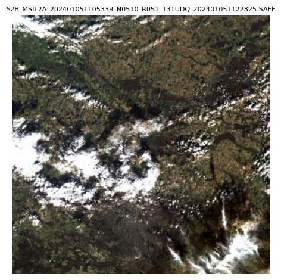
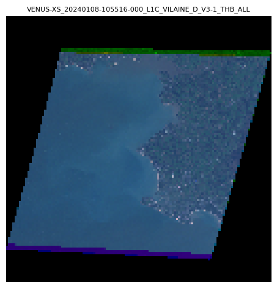
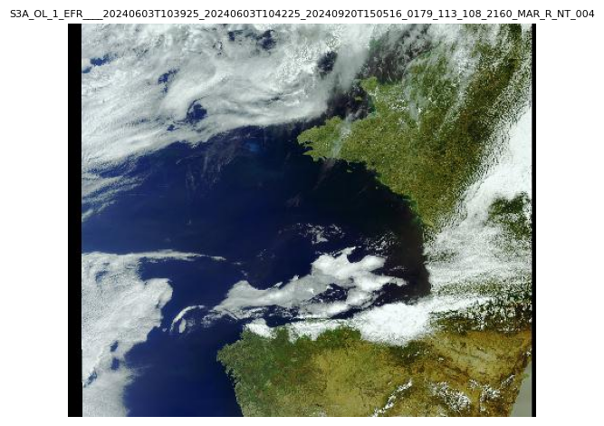
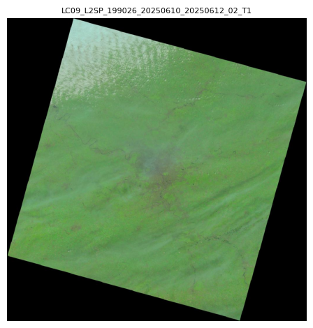

SAND provides three ways to retrieve product data from any provider:

1.  **Acquisition** — Download the full product archive, then read it as an `xarray.Dataset` using `eoread`.
2.  **Quicklook** — Download a preview thumbnail image for visual inspection.
3.  **Metadata** — Retrieve the full product metadata as a Python dictionary.

This guide demonstrates each operation using a representative product from every provider.

## Copernicus Data Space (DownloadCDSE)

This example demonstrates the workflow for a **MSI** (MultiSpectral Instrument) product from the Copernicus Data Space. The query searches for Sentinel-2 Level 2A acquisitions over Paris, France, with less than 30% cloud cover.

The cell below returns a `SandProduct` representing the first matching acquisition. Its string summary shows the product ID, acquisition date, and geographic footprint.

```python
from sand.copernicus_dataspace import DownloadCDSE
from sand.constraint import Time, Geo

dl = DownloadCDSE(verbose=False)

results = dl.query(
    collection_sand="SENTINEL-2-MSI",
    level=2,
    time=Time("2024-01-01", "2024-01-10"),
    geo=Geo.Point(lat=48.8566, lon=2.3522),
    cloudcover_thres=30,
)
product = results[0]
```

### Acquisition

The cell below downloads the full Sentinel-2 archive (a ZIP file) and opens it with `eoread`. The output is an `xarray.Dataset` that displays the spatial dimensions, band coordinates, and all data variables (reflectance bands, masks, etc.) ready for analysis.

```python
from eoread.msi import Level1_MSI

archive_path = dl.download(product, out_dir / "cdse")
ds = Level1_MSI(archive_path, verbose=False)
```

```bash
<xarray.Dataset> Size: 335MB
Dimensions:      (tie_rows: 23, tie_columns: 23, bands: 13, y: 1830, x: 1830)
Coordinates:
  * tie_rows     (tie_rows) int32 92B 0 83 166 249 332 ... 1579 1662 1745 1829
  * tie_columns  (tie_columns) int32 92B 0 83 166 249 ... 1579 1662 1745 1829
  * bands        (bands) <U3 156B 'B1' 'B2' 'B3' 'B4' ... 'B9' 'B10' 'B11' 'B12'
    bands_group  (bands) <U9 468B 'bands_60m' 'bands_10m' ... 'bands_20m'
  * y            (y) int64 15kB 0 1 2 3 4 5 6 ... 1824 1825 1826 1827 1828 1829
  * x            (x) int64 15kB 0 1 2 3 4 5 6 ... 1824 1825 1826 1827 1828 1829
Data variables:
    Rtoa         (bands, y, x) float32 174MB dask.array<chunksize=(1, 457, 457), meta=np.ndarray>
    longitude    (y, x) float64 27MB dask.array<chunksize=(457, 457), meta=np.ndarray>
    latitude     (y, x) float64 27MB dask.array<chunksize=(457, 457), meta=np.ndarray>
    sza_tie      (tie_rows, tie_columns) float32 2kB 73.56 73.55 ... 72.37 72.36
    sza          (y, x) float64 27MB dask.array<chunksize=(457, 457), meta=np.ndarray>
    saa_tie      (tie_rows, tie_columns) float32 2kB 165.3 165.3 ... 166.6 166.7
    saa          (y, x) float64 27MB dask.array<chunksize=(457, 457), meta=np.ndarray>
    vza_tie      (tie_rows, tie_columns) float32 2kB 9.868 9.491 ... 2.176 2.346
    vza          (y, x) float64 27MB dask.array<chunksize=(457, 457), meta=np.ndarray>
    vaa_tie      (tie_rows, tie_columns) float32 2kB 94.08 93.81 ... 217.1 226.1
    vaa          (y, x) float64 27MB dask.array<chunksize=(457, 457), meta=np.ndarray>
    cwav         (bands) float64 104B 442.3 492.3 559.0 ... 1.61e+03 2.186e+03
Attributes: (12/14)
    totalheight:       1830
    totalwidth:        1830
    datetime:          2024-01-05T10:57:28.322388Z
    platform:          Sentinel-2B
    resolution:        60
    sensor:            MSI
    ...                ...
    user_guide:        https://sentinels.copernicus.eu/documents/247904/68521...
    metadata_granule:  {'attributes': {'{http://www.w3.org/2001/XMLSchema-ins...
    metadata:          {'attributes': {'{http://www.w3.org/2001/XMLSchema-ins...
    _flag_reader:      eoread.msi.FlagsReader_MSI
    _srf_getter:       eotools.srf.get_SRF_eumetsat
    _srf_getter_arg:   sentinel2_2_msi
```

### Quicklook

The cell below downloads the product's embedded thumbnail and renders it. The output is a true-color preview image, useful for visually confirming the scene quality before downloading the full acquisition.

```python
from PIL import Image
from tempfile import TemporaryDirectory
import matplotlib.pyplot as plt

with TemporaryDirectory() as tmpdir: 
    ql_path = dl.quicklook(product, tmpdir)
    img = Image.open(ql_path)
    plt.figure()
    plt.title(ql_path.stem, fontdict={'fontsize': 8})
    plt.imshow(img)
    plt.axis("off")
    plt.tight_layout()
    plt.show()
```



### Metadata

The cell below retrieves the complete product metadata as a Python dictionary. The output shows a selection of key fields such as the product ID, title, acquisition timestamp, and cloud cover percentage.

```python
meta = dl.metadata(product)
```

## CNES Geodes (DownloadCNES)

This example demonstrates the workflow for a **VENUS** (Véhicule d'Expérimentation pour le Nouveau Système) product from CNES Geodes. The query searches for Level 2 VENUS acquisitions over Paris, France.

The cell below returns a `SandProduct` representing the first matching acquisition. Its string summary shows the product ID, acquisition date, and geographic footprint.

```python
from sand.cnes import DownloadCNES

dl = DownloadCNES(verbose=False)

results = dl.query(
    collection_sand="VENUS",
    level=1,
    time=Time("2024-01-01", "2025-01-01"),
    geo=Geo.Tile(venus='VILAINE'),
)
product = results[0]
```

### Acquisition

The cell below downloads the full VENUS product archive and opens it with `eoread`. The output is an `xarray.Dataset` that displays the spatial dimensions, spectral bands, and all data variables (reflectance, atmospheric corrections, etc.) ready for analysis.

```python
from eoread.venus import Level_VENUS

archive_path = dl.download(product, out_dir / "cnes")
ds = Level_VENUS(archive_path, verbose=False)
```

```bash
<xarray.Dataset> Size: 25GB
Dimensions:      (bands: 12, bands_angle: 4, x_tie: 27, y_tie: 24, y: 11400,
                  x: 12781)
Coordinates:
  * bands        (bands) <U3 144B 'B1' 'B2' 'B3' 'B4' ... 'B9' 'B10' 'B11' 'B12'
    bands_group  (bands) <U10 480B 'bands_vnir' 'bands_vnir' ... 'bands_vnir'
  * bands_angle  (bands_angle) int64 32B 1 2 3 4
  * x_tie        (x_tie) float64 216B 5.091e+05 5.111e+05 ... 5.611e+05
  * y_tie        (y_tie) float64 192B 5.269e+06 5.267e+06 ... 5.223e+06
  * y            (y) int64 91kB 0 1 2 3 4 5 ... 11395 11396 11397 11398 11399
  * x            (x) int64 102kB 0 1 2 3 4 5 ... 12776 12777 12778 12779 12780
Data variables:
    cwav         (bands) int64 96B 424 447 492 555 620 ... 702 741 782 861 909
    SOL_ALL      (bands_angle, y_tie, x_tie) float32 10kB dask.array<chunksize=(4, 24, 27), meta=np.ndarray>
    VIE_ALL      (bands_angle, y_tie, x_tie) float32 10kB dask.array<chunksize=(4, 24, 27), meta=np.ndarray>
    Rtoa         (bands, y, x) float32 7GB dask.array<chunksize=(1, 500, 500), meta=np.ndarray>
    longitude    (y, x) float64 1GB dask.array<chunksize=(500, 500), meta=np.ndarray>
    latitude     (y, x) float64 1GB dask.array<chunksize=(500, 500), meta=np.ndarray>
    CLA_ALL      (y, x) float32 583MB dask.array<chunksize=(500, 500), meta=np.ndarray>
    CLD_XS       (y, x) float32 583MB dask.array<chunksize=(500, 500), meta=np.ndarray>
    USI_XS       (y, x) float32 583MB dask.array<chunksize=(500, 500), meta=np.ndarray>
    PIX          (bands, y, x) float32 7GB dask.array<chunksize=(1, 500, 500), meta=np.ndarray>
    SAT          (bands, y, x) float32 7GB dask.array<chunksize=(1, 500, 500), meta=np.ndarray>
Attributes: (12/14)
    totalheight:       11400
    totalwidth:        12781
    datetime:          2024-01-08T10:55:16.000
    platform:          VENUS
    resolution:        4
    sensor:            VENUS
    ...                ...
    metadata_granule:  {'attributes': {'{http://www.w3.org/2001/XMLSchema-ins...
    metadata:          {'attributes': {'{http://www.w3.org/2001/XMLSchema-ins...
    user_guide:        https://www.cesbio.cnrs.fr/multitemp/ven%c2%b5s-produc...
    _flag_reader:      eoread.venus.FlagsReader_VENUS
    _srf_getter:       eoread.venus.get_SRF
    _srf_getter_arg:   None
```

### Quicklook

The cell below downloads the product's embedded thumbnail and renders it. The output is a true-color preview image, useful for visually confirming the scene quality before downloading the full acquisition.

```python
from PIL import Image
from tempfile import TemporaryDirectory
import matplotlib.pyplot as plt

with TemporaryDirectory() as tmpdir: 
    ql_path = dl.quicklook(product, tmpdir)
    img = Image.open(ql_path)
    plt.figure()
    plt.title(ql_path.stem, fontdict={'fontsize': 8})
    plt.imshow(img)
    plt.axis("off")
    plt.tight_layout()
    plt.show()
```



### Metadata

The cell below retrieves the complete product metadata as a Python dictionary. The output shows key fields such as the product ID, geometry (footprint), and properties (acquisition parameters, sensor settings, etc.).

```python
meta = dl.metadata(product)
```

## EUMETSAT Data Store (DownloadEumDAC)

This example demonstrates the workflow for an **OLCI** (Ocean and Land Colour Instrument) product from the EUMETSAT Data Store. The query searches for Sentinel-3 Level 2 acquisitions over Paris, France.

The cell below returns a `SandProduct` representing the first matching acquisition. Its string summary shows the product ID, acquisition date, and geographic footprint.

```python
from sand.eumdac import DownloadEumDAC

dl = DownloadEumDAC(verbose=False)

results = dl.query(
    collection_sand="SENTINEL-3-OLCI-FR",
    level=1,
    time=Time("2024-06-01", "2024-06-10"),
    geo=Geo.Point(lat=48.8566, lon=2.3522),
)
product = results[0]
```

### Acquisition

The cell below downloads the full Sentinel-3 OLCI product archive and opens it with `eoread`. The output is an `xarray.Dataset` that displays the spatial dimensions, spectral bands, and all data variables (reflectance, temperature, quality flags, etc.) ready for analysis.

```python
from eoread.olci import Level1_OLCI

archive_path = dl.download(product, out_dir / "eumdac")
ds = Level1_OLCI(archive_path, verbose=False)
```

```bash
<xarray.Dataset> Size: 10GB
Dimensions:                          (bands: 21, y: 4091, x: 4865,
                                      tie_columns: 77, tie_rows: 4091,
                                      detectors: 3700)
Coordinates:
  * bands                            (bands) <U4 336B 'Oa01' 'Oa02' ... 'Oa21'
    bands_group                      (bands) <U10 840B dask.array<chunksize=(1,), meta=np.ndarray>
  * y                                (y) int64 33kB 0 1 2 3 ... 4088 4089 4090
  * x                                (x) int64 39kB 0 1 2 3 ... 4862 4863 4864
  * tie_columns                      (tie_columns) int64 616B 0 64 ... 4800 4864
  * tie_rows                         (tie_rows) int64 33kB 0 1 2 ... 4089 4090
Dimensions without coordinates: detectors
Data variables: (12/31)
    cwav                             (bands) float64 168B dask.array<chunksize=(1,), meta=np.ndarray>
    Ltoa                             (bands, y, x) float32 2GB dask.array<chunksize=(1, 500, 500), meta=np.ndarray>
    altitude                         (y, x) float32 80MB dask.array<chunksize=(500, 500), meta=np.ndarray>
    latitude                         (y, x) float32 80MB dask.array<chunksize=(500, 500), meta=np.ndarray>
    longitude                        (y, x) float32 80MB dask.array<chunksize=(500, 500), meta=np.ndarray>
    sza                              (y, x) float64 159MB dask.array<chunksize=(500, 500), meta=np.ndarray>
    ...                               ...
    lambda0                          (bands, detectors) float32 311kB dask.array<chunksize=(1, 3700), meta=np.ndarray>
    solar_flux                       (bands, detectors) float32 311kB dask.array<chunksize=(1, 3700), meta=np.ndarray>
    quality_flags                    (y, x) uint32 80MB dask.array<chunksize=(500, 500), meta=np.ndarray>
    wav                              (bands, y, x) float32 2GB dask.array<chunksize=(1, 500, 500), meta=np.ndarray>
    F0                               (bands, y, x) float32 2GB dask.array<chunksize=(1, 500, 500), meta=np.ndarray>
    Rtoa                             (bands, y, x) float64 3GB dask.array<chunksize=(1, 500, 500), meta=np.ndarray>
Attributes:
    metadata:         {'attributes': {'version': 'esa/safe/sentinel/sentinel-...
    footprint_lat:    (41.9714, 41.8936, 41.8118, 41.7241, 41.6322, 41.5321, ...
    footprint_lon:    (-2.45334, -1.61412, -0.794523, 0.023626, 0.847814, 1.6...
    datetime:         2024-06-01T09:52:17.556382+00:00
    platform:         Sentinel-3A
    resolution:       500
    sensor:           OLCI
    product_name:     S3A_OL_1_EFR____20240601T095048_20240601T095348_2024092...
    input_directory:  tmpdir/S3A_OL_1_EFR____20240601T095048_20240601T095348_...
    _flag_reader:     eoread.olci.FlagsReader_OLCI
    _srf_getter:      eotools.srf.get_SRF_olci
    _srf_getter_arg:  sentinel3_1_olci
```

### Quicklook

The cell below downloads the product's embedded thumbnail and renders it. The output is a true-color preview image, useful for visually confirming the scene quality before downloading the full acquisition.

```python
from PIL import Image
from tempfile import TemporaryDirectory
import matplotlib.pyplot as plt

with TemporaryDirectory() as tmpdir: 
    ql_path = dl.quicklook(product, tmpdir)
    img = Image.open(ql_path)
    plt.figure()
    plt.title(ql_path.stem, fontdict={'fontsize': 8})
    plt.imshow(img)
    plt.axis("off")
    plt.tight_layout()
    plt.show()
```



### Metadata

The cell below retrieves the complete product metadata as a Python dictionary. The output shows a selection of key fields such as the product ID, title, acquisition timestamp, and processing level.

```python
meta = dl.metadata(product)
{key: meta[key] for key in list(meta.keys())[:8]}
```

## NASA Earthdata (DownloadNASA)

This example demonstrates the workflow for an **OLI** (Operational Land Imager) product from NASA Earthdata. The query searches for Landsat-8 Level 2 surface reflectance acquisitions over Paris, France, with less than 20% cloud cover.

The cell below returns a `SandProduct` representing the first matching acquisition. Its string summary shows the product ID, acquisition date, and geographic footprint.

```python
from sand.nasa import DownloadNASA

dl = DownloadNASA(verbose=False)

results = dl.query(
    collection_sand="ISS-ECOSTRESS",
    level=1,
    time=Time("2024-07-01", "2024-08-10"),
    geo=Geo.Point(lat=48.8566, lon=2.3522),
)
product = results[0]
```

### Acquisition

The cell below downloads the full Landsat-8 product archive and opens it with `eoread`. The output is an `xarray.Dataset` that displays the spatial dimensions, spectral bands, and all data variables (surface reflectance, thermal bands, pixel quality, etc.) ready for analysis.

```python
from eoread.landsat8_oli import Level_L8_OLI

archive_path = dl.download(product, out_dir / "nasa")
ds = Level_L8_OLI(archive_path, verbose=False)
```

### Quicklook

The cell below downloads the product's embedded thumbnail and renders it. The output is a true-color preview image, useful for visually confirming the scene quality before downloading the full acquisition.

```python
from PIL import Image
from tempfile import TemporaryDirectory
import matplotlib.pyplot as plt

with TemporaryDirectory() as tmpdir: 
    ql_path = dl.quicklook(product, tmpdir)
    img = Image.open(ql_path)
    plt.figure()
    plt.title(ql_path.stem, fontdict={'fontsize': 8})
    plt.imshow(img)
    plt.axis("off")
    plt.tight_layout()
    plt.show()
```

### Metadata

The cell below retrieves the complete product metadata as a Python dictionary. The output shows key fields such as the product ID, title, summary description, and the URLs to access the product assets.

```python
meta = dl.metadata(product)
{key: meta[key] for key in list(meta.keys())[:8]}
```

## USGS (DownloadUSGS)

This example demonstrates the workflow for an **OLI** (Operational Land Imager) product from USGS. The query searches for Landsat-9 Level 1 surface reflectance acquisitions over Paris, France, with less than 20% cloud cover.

The cell below returns a `SandProduct` representing the first matching acquisition. Its string summary shows the product ID, acquisition date, and geographic footprint.

```python
from sand.usgs import DownloadUSGS

dl = DownloadUSGS(verbose=False)

results = dl.query(
    collection_sand="LANDSAT-9-OLI",
    level=1,
    time=Time("2024-06-01", "2025-06-10"),
    geo=Geo.Point(lat=48.8566, lon=2.3522),
    cloudcover_thres=20,
)
product = results[0]
```

### Acquisition

The cell below downloads the full Landsat-9 product archive and opens it with `eoread`. The output is an `xarray.Dataset` that displays the spatial dimensions, spectral bands, and all data variables (surface reflectance, thermal bands, pixel quality, etc.) ready for analysis.

```python
from eoread.landsat9_oli import Level_L9_OLI

archive_path = dl.download(product, out_dir / "usgs")
ds = Level_L9_OLI(archive_path, verbose=False)
```

```bash
<xarray.Dataset> Size: 11GB
Dimensions:       (y: 7911, x: 7821, x_pan: 15821, y_pan: 15641, bands: 10)
Coordinates:
  * y             (y) int64 63kB 0 1 2 3 4 5 6 ... 7905 7906 7907 7908 7909 7910
  * x             (x) int64 63kB 0 1 2 3 4 5 6 ... 7815 7816 7817 7818 7819 7820
  * bands         (bands) <U2 80B '1' '2' '3' '4' '5' '6' '7' '9' '10' '11'
    bands_group   (bands) <U10 400B 'bands_vnir' 'bands_vnir' ... 'bands_ir'
Dimensions without coordinates: x_pan, y_pan
Data variables: (12/13)
    saa           (y, x) float32 247MB dask.array<chunksize=(500, 500), meta=np.ndarray>
    sza           (y, x) float32 247MB dask.array<chunksize=(500, 500), meta=np.ndarray>
    vaa           (y, x) float32 247MB dask.array<chunksize=(500, 500), meta=np.ndarray>
    vza           (y, x) float32 247MB dask.array<chunksize=(500, 500), meta=np.ndarray>
    QA_RADSAT     (y, x) float32 247MB dask.array<chunksize=(500, 500), meta=np.ndarray>
    QA_PIXEL      (y, x) float32 247MB dask.array<chunksize=(500, 500), meta=np.ndarray>
    ...            ...
    Ltoa          (bands, y, x) float32 2GB dask.array<chunksize=(1, 500, 500), meta=np.ndarray>
    Rtoa          (bands, y, x) float32 2GB dask.array<chunksize=(1, 500, 500), meta=np.ndarray>
    BT            (bands, y, x) float32 2GB dask.array<chunksize=(1, 500, 500), meta=np.ndarray>
    latitude      (y, x) float64 495MB dask.array<chunksize=(500, 500), meta=np.ndarray>
    longitude     (y, x) float64 495MB dask.array<chunksize=(500, 500), meta=np.ndarray>
    cwav          (bands) float64 80B 443.0 482.0 561.4 ... 1.09e+04 1.205e+04
Attributes:
    metadata:         {'PRODUCT_CONTENTS': {'ORIGIN': 'Image courtesy of the ...
    datetime:         2024-02-09T10:34:57.5923370Z
    totalheight:      7911
    totalwidth:       7821
    platform:         LANDSAT_9
    sensor:           OLI_TIRS
    product_name:     LC09_L1GT_198026_20240209_20240209_02_T2
    resolution:       30
    user_guide:       https://greenpolicy360.net/images/Landsat8DataUsersHand...
    _flag_reader:     eoread.oli.FlagsReader_OLI
    _srf_getter:      eoread.oli.get_srf_landsat_oli
    _srf_getter_arg:  landsat_9_oli
```

### Quicklook

The cell below downloads the product's embedded thumbnail and renders it. The output is a true-color preview image, useful for visually confirming the scene quality before downloading the full acquisition.

```python
from PIL import Image
from tempfile import TemporaryDirectory
import matplotlib.pyplot as plt

with TemporaryDirectory() as tmpdir: 
    ql_path = dl.quicklook(product, tmpdir)
    img = Image.open(ql_path)
    plt.figure()
    plt.title(ql_path.stem, fontdict={'fontsize': 8})
    plt.imshow(img)
    plt.axis("off")
    plt.tight_layout()
    plt.show()
```



### Metadata

The cell below retrieves the complete product metadata as a Python dictionary. The output shows a selection of key fields such as the product ID, path/row, acquisition timestamp, and cloud cover percentage.

```python
meta = dl.metadata(product)
{key: meta[key] for key in list(meta.keys())[:8]}
```

## Summary

| Provider           | Collection          | `eoread` reader             | Level class     |
|--------------------|---------------------|-----------------------------|-----------------|
| `DownloadCDSE`     | SENTINEL-2-MSI      | `eoread.msi.Level1_MSI`     | `Level1_MSI`    |
| `DownloadCNES`     | VENUS               | `eoread.venus.Level1_VENUS` | `Level1_VENUS`  |
| `DownloadEumDAC`   | SENTINEL-3-OLCI-FR  | `eoread.olci.Level1_OLCI`   | `Level1_OLCI`   |
| `DownloadNASA`     | LANDSAT-8-OLI       | `eoread.oli.Level1_OLI`     | `Level1_OLI`    |
| `DownloadUSGS`     | LANDSAT-9-OLI       | `eoread.oli.Level1_OLI`     | `Level1_OLI`    |

Not all collections have an `eoread` reader. Refer to the [API Reference](../reference/) for the full list of supported collections per provider.